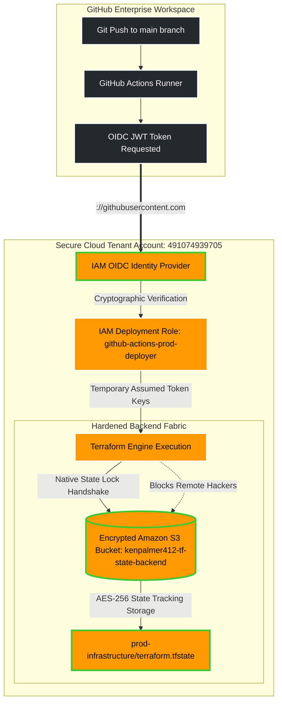

# AWS OIDC Pipeline Architecture

```mermaid
graph TD
    %% Styling Configuration
    classDef github fill:#24292e,stroke:#fff,stroke-width:2px,color:#fff;
    classDef aws fill:#ff9900,stroke:#fff,stroke-width:2px,color:#000;
    classDef secure stroke:#33cc33,stroke-width:3px;

    %% Elements Layout
    subgraph GitHub_Platform [GitHub Enterprise Workspace]
        A[Git Push to main branch]:::github --> B[GitHub Actions Runner]:::github
        B --> C[OIDC JWT Token Requested]:::github
    end

    subgraph AWS_Cloud [Secure Cloud Tenant Account: 491074939705]
        D[IAM OIDC Identity Provider]:::aws -->|Cryptographic Verification| E[IAM Deployment Role: github-actions-prod-deployer]:::aws
        E -->|Temporary Assumed Token Keys| F[Terraform Engine Execution]:::aws
        
        subgraph Isolation_Boundary [Hardened Backend Fabric]
            F -->|Native State Lock Handshake| G[(Encrypted Amazon S3 Bucket: kenpalmer412-tf-state-backend)]:::aws
            G -->|AES-256 State Tracking Storage| H[prod-infrastructure/terraform.tfstate]:::aws
        end
    end

    %% Flow Transitions
    C ===>|://githubusercontent.com| D:::secure
    F -.->|Blocks Remote Hackers| G

    %% Applying Secure Border
    class G,H secure;
```

